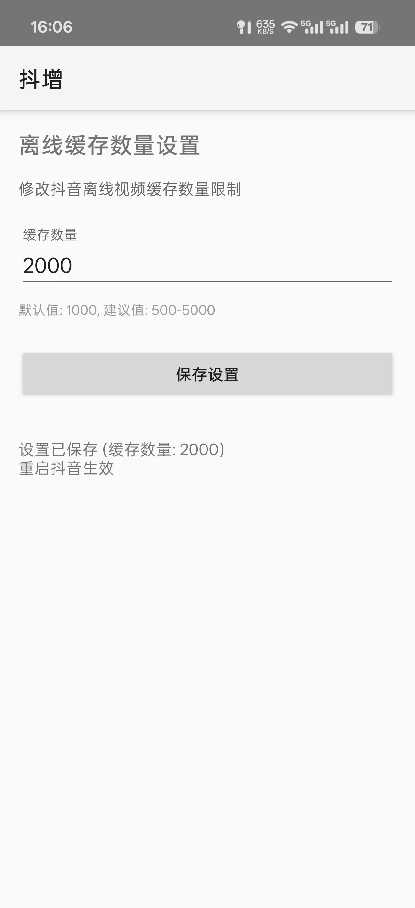
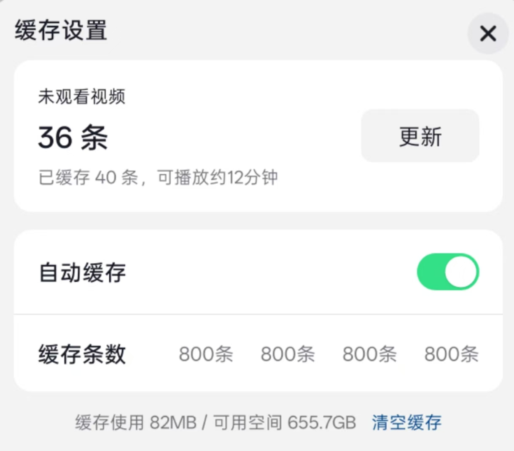

# 抖增 - 抖音离线缓存增强模块


## 📱 功能介绍

**抖增** 是一个基于 LSPosed 的抖音离线缓存增强模块，可以突破抖音官方对离线缓存数量的限制，让你能够缓存更多视频。




### 主要特性

- ✅ **自定义缓存数量** - 支持设置任意缓存数量（默认 1000，建议不超过 10000）
- ✅ **自动适配混淆** - 基于 DexKit 字符串匹配技术，不依赖混淆方法名，自动适配抖音版本升级
- ✅ **多维度 Hook** - 同时拦截缓存数量读取、按钮状态、启用状态、UI 文本显示、对话框参数等
- ✅ **UI 文本同步** - 自动修改离线模式面板中的所有缓存选项文本（50条/100条/150条/200条 → 自定义值）
- ✅ **对话框拦截** - 拦截"调整缓存上限"对话框参数，确保显示的数值与设置一致

### Hook 目标

| 目标类 | Hook 方法 | 行为 |
|--------|----------|------|
| `OfflineKevaUtils` | 缓存数量读取 (`cache_count`) | 替换为自定义值 |
| `OfflineKevaUtils` | 真实缓存数 (`true_cache_count`) | 替换为自定义值 |
| `OfflineKevaUtils` | 按钮状态 (`cache_btn_status`) | 修复异常状态 (-1 → 0) |
| `OfflineKevaUtils` | 启用状态 (`user_enable`) | 强制启用 (0 → 1) |
| `OfflineModeDownloadOptPanel` | UI 初始化 (`initView`) | 修改选项文本 |
| `OfflineModeDownloadOptPanel` | 选项切换 (`updateCacheCountSelection`) | 保持自定义文本 |
| `OfflineModeDownloadOptPanel` | 布局刷新 (`updateLayoutView`) | 保持自定义文本 |
| `OfflineModeDownloadOptPanel` / `SettingDialog` | 调整上限对话框 (`showAdjustCacheCountDialog`) | 替换对话框参数 |

> **注意**：方法定位基于源码中的 Keva key 字符串常量（如 `"cache_count"`、`"user_enable"`），而非混淆后的方法名（如 `LJFF()`、`LJIILL()`）。即使抖音更新版本导致混淆名变化，只要源码逻辑不变，Hook 即可正常工作。

### 适用场景

- 在高铁/飞机上离线观看大量抖音视频
- 抖音官方缓存数量限制不够用（默认仅支持 50/100/150/200 条）
- 需要批量缓存喜欢的视频内容

## 🏗️ 技术架构

```
┌─────────────────────────────────────────────────────┐
│                    LSPosed API 101                   │
├─────────────────────────────────────────────────────┤
│              YukiHookAPI 1.3.1                      │
│         (Hook DSL / prefs / Resources)              │
├──────────┬──────────────────────────┬───────────────┤
│ DexKit   │ KavaRef                  │ XSharedPreferences │
│ 2.0.4    │ (类/方法反射查找)          │ (配置持久化)      │
│ (字符串  │                          │                 │
│ 匹配查找 │                          │                 │
│ 类和方法) │                          │                 │
└──────────┴──────────────────────────┴───────────────┘
```

## 📦 安装方法

### 前置条件

- 已安装 [LSPosed](https://github.com/LSPosed/LSPosed) 框架（API 版本 ≥ 93）

### 安装步骤

1. **下载模块 APK**
   - 从 [GitHub Releases](https://github.com/Liberations/Douzeng/releases) 下载最新版本
   - 或从 LSPosed 商店直接搜索「抖增」安装

2. **安装 APK**
   ```bash
   adb install douzeng-xxx.apk
   ```

3. **启用模块**
   - 打开 LSPosed 管理器
   - 找到「抖增」模块并**启用**
   - 勾选**「抖音」(com.ss.android.ugc.aweme)** 作为作用域

4. **配置缓存数量**
   - 打开「抖增」模块 App
   - 设置你想要的缓存数量（如 1500）
   - 点击保存

5. **重启抖音**
   - 强制停止抖音
   - 重新启动抖音
   - 进入「我的」→「离线缓存」查看效果

## ⚠️ 注意事项

1. **模块作用域** - 必须在 LSPosed 中将作用域设置为**抖音**（`com.ss.android.ugc.aweme`）
2. **重启生效** - 修改设置后需要**强制停止并重启**抖音才能生效
3. **缓存数量建议** - 不超过 10000 条，过大可能导致：
   - 占用过多存储空间
   - 首次加载变慢
   - 离线列表滚动卡顿
4. **版本兼容性** - 本模块通过 DexKit 动态匹配，理论上兼容多个抖音版本。如遇问题请提供日志反馈
5. **日志调试** - 开启调试后可在 Logcat 中过滤 `DouZeng` TAG 查看详细日志

## 🐛 问题反馈

如果遇到问题，请在 [GitHub Issues](https://github.com/Liberations/Douzeng/issues) 中反馈，并提供：

- 抖音版本号（设置 → 关于抖音）
- Android 系统版本号
- LSPosed 版本及 API Level
- 相关日志（Logcat 过滤 `DouZeng`）：
  ```bash
  adb logcat -s DouZeng:D
  ```

## 📄 许可证

本项目基于 MIT 许可证开源。

## 🙏 致谢

- [LSPosed](https://github.com/LSPosed/LSPosed) - 现代 Xposed 框架实现
- [YukiHookAPI](https://github.com/HighCapable/YukiHookAPI) - 高效 Kotlin Hook API
- [DexKit](https://github.com/LuckyPray/DexKit) - Dex 字符串匹配查找工具
- [KavaRef](https://github.com/HighCapable/KavaRef) - 现代化 Java 反射库
